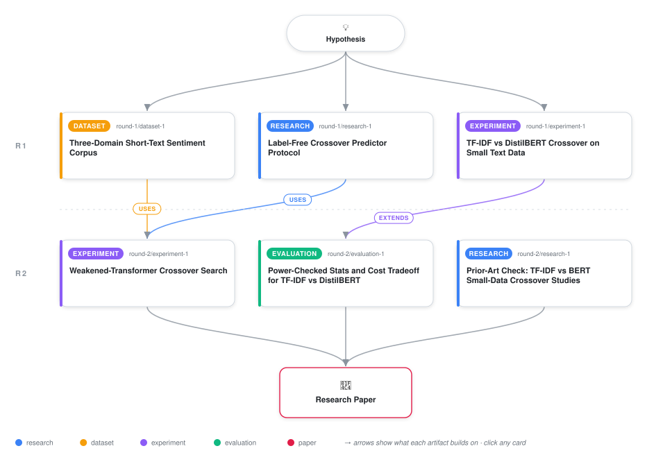

# Weakening the Transformer Reveals a Crossover, but the Label-Free Predictor Still Cannot Find It

<div align="center">

<a href="https://cdn.jsdelivr.net/gh/ai-inventor-papers/ai-invention-d8fc3d-vocabulary-saturation-predicts-the@main/workflow.svg">
<picture>
  <source media="(prefers-color-scheme: dark)" srcset="workflow-dark.svg">
  
</picture>
</a>

<sub>🖱️ <b><a href="https://cdn.jsdelivr.net/gh/ai-inventor-papers/ai-invention-d8fc3d-vocabulary-saturation-predicts-the@main/workflow.svg">Open the interactive diagram</a></b> — every card links to its artifact folder.</sub>

</div>

> **TL;DR** — Iteration 2 deliberately weakens the transformer arm (BERT-tiny; DistilBERT truncated to 8 or 16 tokens) against TF-IDF+LR on TweetEval and Rotten Tomatoes, restoring 3 genuine accuracy crossovers where a full-strength DistilBERT (prior iteration) had none. The Good-Turing/Chao1 label-light crossover predictor is then exercised, for the first time end-to-end, across all 6 calibrate-on-one/predict-on-another directions -- and fails in all 6 (5 directions predict no finite crossover at all; the 1 computable correlation is rho=-0.866, n=3, wrong sign, not significant). A power analysis shows such small-n correlation checks are too underpowered to distinguish 'no signal' from 'a real but modest signal', and a wall-clock cost table shows DistilBERT costs 174-197x the CPU time of TF-IDF at matched n. A targeted literature dossier scopes the novelty claim: TF-IDF-vs-transformer comparisons exist in the literature (Chen/Li et al. 2020/2022 clinical-text sweep; Galke et al. 2022 survey; Shanto et al. 2026; Bucher & Martini 2024) but none combine a controlled multi-seed sweep with a label-light crossover predictor.

<details>
<summary>Full hypothesis</summary>

For short-text sentiment classification, we now have direct evidence on both halves of the original claim. (1) [CONFIRMED, new this iteration] A classical-vs-transformer crossover is not intrinsically absent from this task family - it was absent specifically because the previously-tested transformer (full-strength DistilBERT) was too strong. Deliberately weakening the transformer arm (input-truncation to 8 or 16 tokens, or a much smaller pretrained checkpoint such as BERT-tiny) restores genuine, finite crossovers in 3 of 6 (domain, weakened-model) pairs tested (Rotten Tomatoes/trunc16 at n*=50, Rotten Tomatoes/trunc8 at n*=200, TweetEval/trunc16 at n*=500), using tweet_eval as a genuinely independent third domain that breaks the Rotten Tomatoes/SST-2 shared-lineage confound. (2) [REFUTED in the tested regime, evidence strengthened] With real crossovers finally available to calibrate and predict against, the Good-Turing/Chao1 label-light coverage predictor was exercised end-to-end for the first time in all 6 directed calibrate-on-one/predict-on-another tests and produced no usable signal in any direction: 5 of 6 directions yield no finite candidate crossover at all, and the calibration constant tau is estimated at exactly 0.0 in every direction. We do NOT yet know whether tau=0.0 reflects a genuine degenerate finding (coverage curves flat/near-1 at all tested pilot sizes for these domains, i.e., the vocabulary-coverage mechanism has no calibratable signal here) or an artifact of the fitting procedure (e.g., a formula defaulting to 0 on a near-zero denominator, or an input shape the routine cannot handle) - this ambiguity, raised as a MAJOR reviewer critique, means the 0/6 headline should be read as 'the predictor gave no evidence of working' rather than 'the mechanism is proven to carry no signal,' pending a diagnostic trace of the intermediate tau-fitting arithmetic for each direction. The single computable rank correlation (Rotten Tomatoes/trunc8 <-> TweetEval/trunc16, Spearman rho=-0.866, n=3, p=0.333) is explicitly downgraded from a headline 'wrong-sign' finding to one underpowered, non-significant data point among six directions, since a 3-point correlation cannot distinguish a real reversed relationship from noise. We also flag, per reviewer critique, that the paper's central 170-200x cost-ratio claim rests on a measured DistilBERT time against an analytically ESTIMATED (not measured) TF-IDF+LR time, an asymmetry inconsistent with the paper's own log-everything ethos and requiring either direct instrumentation of TF-IDF's wall-clock cost or an explicit uncertainty bound on the ratio. Two of the three crossovers are also flagged as evidentially fragile: the trunc16/Rotten-Tomatoes crossover sits at the smallest tested grid point (n*=50), so the true crossover could lie below the tested range and remains unobserved, and the trunc8/Rotten-Tomatoes crossover (n*=200) follows a near-tie (+0.005/+0.005) at n=50/100 with only 3 seeds, making its exact location sensitive to seed-level noise. Whether the f2<10 instability flag fired at the pilot sizes feeding the null tau/rho results is not yet reported, and its absence would materially change how the 0/6 result should be characterized (predictor unstable at these pilot sizes vs. predictor stable but wrong).

</details>

[](https://ai-inventor-papers.github.io/ai-invention-d8fc3d-vocabulary-saturation-predicts-the/)

[](https://cdn.jsdelivr.net/gh/ai-inventor-papers/ai-invention-d8fc3d-vocabulary-saturation-predicts-the@main/paper.pdf) [](https://github.com/ai-inventor-papers/ai-invention-d8fc3d-vocabulary-saturation-predicts-the/tree/main/paper_latex)

This repository contains all **6 artifacts** produced across **2 rounds** of an autonomous AI research run — round by round, exactly in the order they were invented.

## Round 1

| Artifact | Type | Demo | Source | Builds on |
|----------|------|------|--------|-----------|
| **[Three-Domain Short-Text Sentiment Corpus](https://github.com/ai-inventor-papers/ai-invention-d8fc3d-vocabulary-saturation-predicts-the/tree/main/round-1/dataset-1)** | [](https://github.com/ai-inventor-papers/ai-invention-d8fc3d-vocabulary-saturation-predicts-the/tree/main/round-1/dataset-1) | [](https://colab.research.google.com/github/ai-inventor-papers/ai-invention-d8fc3d-vocabulary-saturation-predicts-the/blob/main/round-1/dataset-1/demo/data_code_demo.ipynb) | [](https://github.com/ai-inventor-papers/ai-invention-d8fc3d-vocabulary-saturation-predicts-the/tree/main/round-1/dataset-1/src) | — |
| **[Label-Free Crossover Predictor Protocol](https://github.com/ai-inventor-papers/ai-invention-d8fc3d-vocabulary-saturation-predicts-the/tree/main/round-1/research-1)** | [](https://github.com/ai-inventor-papers/ai-invention-d8fc3d-vocabulary-saturation-predicts-the/tree/main/round-1/research-1) | [](https://github.com/ai-inventor-papers/ai-invention-d8fc3d-vocabulary-saturation-predicts-the/blob/main/round-1/research-1/demo/research_demo.md) | [](https://github.com/ai-inventor-papers/ai-invention-d8fc3d-vocabulary-saturation-predicts-the/tree/main/round-1/research-1/src) | — |
| **[TF-IDF vs DistilBERT Crossover on Small Text Data](https://github.com/ai-inventor-papers/ai-invention-d8fc3d-vocabulary-saturation-predicts-the/tree/main/round-1/experiment-1)** | [](https://github.com/ai-inventor-papers/ai-invention-d8fc3d-vocabulary-saturation-predicts-the/tree/main/round-1/experiment-1) | [](https://colab.research.google.com/github/ai-inventor-papers/ai-invention-d8fc3d-vocabulary-saturation-predicts-the/blob/main/round-1/experiment-1/demo/method_code_demo.ipynb) | [](https://github.com/ai-inventor-papers/ai-invention-d8fc3d-vocabulary-saturation-predicts-the/tree/main/round-1/experiment-1/src) | — |

## Round 2

| Artifact | Type | Demo | Source | Builds on |
|----------|------|------|--------|-----------|
| **[Weakened-Transformer Crossover Search](https://github.com/ai-inventor-papers/ai-invention-d8fc3d-vocabulary-saturation-predicts-the/tree/main/round-2/experiment-1)** | [](https://github.com/ai-inventor-papers/ai-invention-d8fc3d-vocabulary-saturation-predicts-the/tree/main/round-2/experiment-1) | [](https://colab.research.google.com/github/ai-inventor-papers/ai-invention-d8fc3d-vocabulary-saturation-predicts-the/blob/main/round-2/experiment-1/demo/method_code_demo.ipynb) | [](https://github.com/ai-inventor-papers/ai-invention-d8fc3d-vocabulary-saturation-predicts-the/tree/main/round-2/experiment-1/src) | <sub><i>uses:</i><br/>[dataset‑1&nbsp;(R1)](https://github.com/ai-inventor-papers/ai-invention-d8fc3d-vocabulary-saturation-predicts-the/tree/main/round-1/dataset-1)<br/>[research‑1&nbsp;(R1)](https://github.com/ai-inventor-papers/ai-invention-d8fc3d-vocabulary-saturation-predicts-the/tree/main/round-1/research-1)</sub> |
| **[Power-Checked Stats and Cost Tradeoff for TF-IDF vs DistilBE…](https://github.com/ai-inventor-papers/ai-invention-d8fc3d-vocabulary-saturation-predicts-the/tree/main/round-2/evaluation-1)** | [](https://github.com/ai-inventor-papers/ai-invention-d8fc3d-vocabulary-saturation-predicts-the/tree/main/round-2/evaluation-1) | [](https://colab.research.google.com/github/ai-inventor-papers/ai-invention-d8fc3d-vocabulary-saturation-predicts-the/blob/main/round-2/evaluation-1/demo/eval_code_demo.ipynb) | [](https://github.com/ai-inventor-papers/ai-invention-d8fc3d-vocabulary-saturation-predicts-the/tree/main/round-2/evaluation-1/src) | <sub><i>extends:</i><br/>[experiment‑1&nbsp;(R1)](https://github.com/ai-inventor-papers/ai-invention-d8fc3d-vocabulary-saturation-predicts-the/tree/main/round-1/experiment-1)</sub> |
| **[Prior-Art Check: TF-IDF vs BERT Small-Data Crossover Studies](https://github.com/ai-inventor-papers/ai-invention-d8fc3d-vocabulary-saturation-predicts-the/tree/main/round-2/research-1)** | [](https://github.com/ai-inventor-papers/ai-invention-d8fc3d-vocabulary-saturation-predicts-the/tree/main/round-2/research-1) | [](https://github.com/ai-inventor-papers/ai-invention-d8fc3d-vocabulary-saturation-predicts-the/blob/main/round-2/research-1/demo/research_demo.md) | [](https://github.com/ai-inventor-papers/ai-invention-d8fc3d-vocabulary-saturation-predicts-the/tree/main/round-2/research-1/src) | — |

## Repository Structure

Artifacts are grouped by the round of invention that produced them. Each
artifact has its own folder with source code and a self-contained demo:

```
.
├── round-1/                         # One folder per round of invention
│   ├── experiment-1/
│   │   ├── README.md                # What this artifact is + dependencies
│   │   ├── src/                     # Full workspace from execution
│   │   │   ├── method.py            # Main implementation
│   │   │   ├── method_out.json      # Full output data
│   │   │   └── ...                  # All execution artifacts
│   │   └── demo/                    # Self-contained demo
│   │       └── method_code_demo.ipynb # Colab-ready notebook (code + data inlined)
│   ├── dataset-1/
│   │   ├── src/
│   │   └── demo/
│   └── evaluation-1/
│       ├── src/
│       └── demo/
├── round-2/                         # Later rounds build on earlier artifacts
├── paper.pdf                        # Research paper
├── paper_latex/                     # LaTeX source files
├── chat/                            # Every prompt, response and tool call, per module
├── workflow.svg                     # Artifact dependency diagram (this page's header)
└── README.md
```

## Running Notebooks

### Option 1: Google Colab (Recommended)

Click the "Open in Colab" badges above to run notebooks directly in your browser.
No installation required!

### Option 2: Local Jupyter

```bash
# Clone the repo
git clone https://github.com/ai-inventor-papers/ai-invention-d8fc3d-vocabulary-saturation-predicts-the
cd ai-invention-d8fc3d-vocabulary-saturation-predicts-the

# Install dependencies
pip install jupyter

# Run any artifact's demo notebook
jupyter notebook <artifact_folder>/demo/
```

## Source Code

The original source files are in each artifact's `src/` folder.
These files may have external dependencies - use the demo notebooks for a self-contained experience.

---
*Generated by AI Inventor Pipeline - Automated Research Generation*
